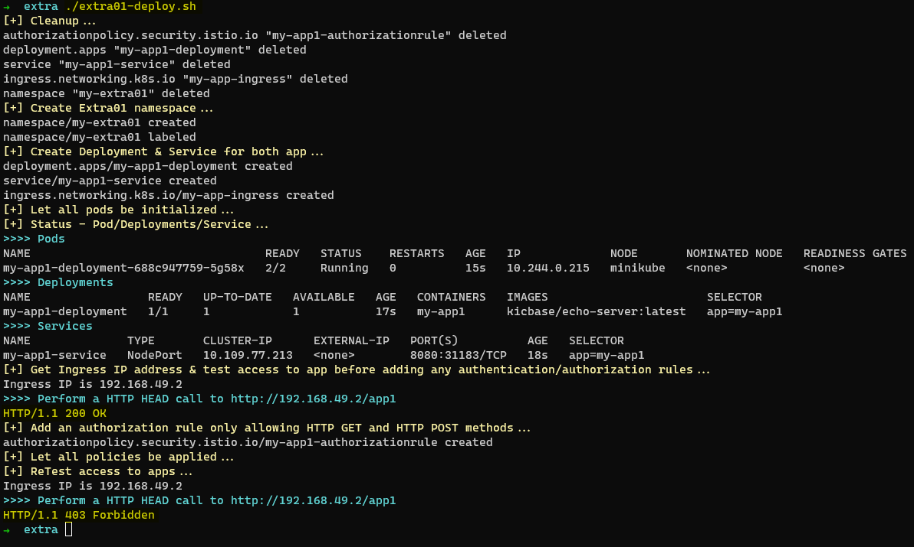

# Extra content

📚 This folder contains extra POC performed to discover different security features provided by Istio.

👀 Each poc use the following naming convention:

```text
extra[0-9]{2}-*.(sh|yaml|png)
```

📦 Where the:

* SH file is the shell script to run the POC.
* YAML files are Kubernetes component descriptors.
* PNG is the demonstration of the execution of the POC.

## Extra01

This POC explore how to limit the type of HTTP request that can be performed to an app. The POC only allow HTTP GET and HTTP POST:



References:

* <https://istio.io/latest/docs/tasks/security/authorization/authz-http/>
* <https://istio.io/latest/docs/reference/config/security/authorization-policy/>
